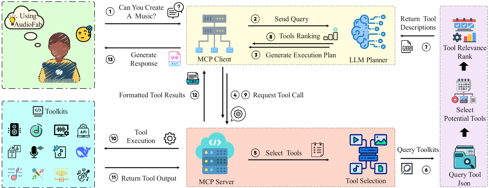

<div align="center">

# AudioFab

<!-- Language Switch with Badges -->
<p>
  <a href="./README.md">
    
  </a>
  <a href="./README_ZH.md">
    
  </a>
  <a href="https://creativecommons.org/licenses/by-nc/4.0/">
    
  </a>
</p>
<!-- Installation Badges with Links -->
<p>
  <a href="#🚀-installation-guide">
    
  </a>
  <a href="#⚡-quick-start">
    
  </a>
</p>

</div>

## 📌 Introduction
AudioFab is a comprehensive and user-friendly open-source intelligent agent framework specifically designed for the audio domain. It aims to solve core challenges such as the complex integration of audio processing tools, frequent dependency conflicts, and the lack of reliability in tool invocation by large language models.

With AudioFab, users can give instructions in natural language to accomplish complex audio tasks that would otherwise require professional software and skills. AudioFab intelligently understands your intent and automatically selects and schedules various underlying professional audio tools to complete the task step-by-step, aggregating powerful functionalities under a unified and simple interaction.

<div align="center">

</div>

AudioFab adopts a standardized architecture based on Model Context Protocols (MCPs), the core of which is an independent tool management mechanism and an intelligent tool selection workflow. The former eradicates dependency conflicts between tools and simplifies the integration process by using isolated runtime environments. The latter effectively mitigates performance degradation and tool hallucination issues caused by excessively long contexts through precise filtering and a few-shot guidance mechanism, significantly enhancing the system's reliability and scalability.

## ✨ Features

**🧩 Independent Tool Management Architecture based on MCPs**

AudioFab introduces an independent tool management architecture based on Model-Context-Protocols (MCPs). This architecture enables each tool to run in its own dedicated dependency environment, fundamentally eliminating dependency conflicts. After a new tool is configured, it can be integrated into the framework through a simple registration process.

**🧠 Intelligent Selection Workflow to Mitigate Tool Hallucination**

AudioFab addresses tool hallucination through a two-stage strategy: first, it streamlines the tool list via intelligent filtering to shorten the context; second, it injects few-shot exemplars for precise guidance before invocation. This design effectively suppresses erroneous model calls, ensuring the stability and reliability of the agent's execution.

**🎧 An Intelligent Audio Agent that is Both User-Friendly and Professional**

AudioFab provides an intelligent audio agent that is easy for non-experts to use, yet professional and comprehensive enough in its functionality. At the same time, its extensive features and high scalability can also meet the in-depth development and research needs of professionals.

## 🛠️ Tool Integration

AudioFab integrates a comprehensive and powerful toolset. The entire system provides services in the form of modular servers, with a clear and easily expandable structure. Its core capabilities cover multiple levels from basic to cutting-edge:

- **Basic Services** include text file management provided by [**Markdown Servers**](#music-mcp-servers), professional-grade audio signal processing and feature extraction provided by [**DSP Servers**](#dsp-servers) and [**Audio Servers**](#audio-servers), and underlying tensor computation and GPU management provided by [**Tensor Servers**](#tensor-servers).

- **Intelligent Discovery** provides powerful tool discovery and query functions through [**Tool Query Servers**](#tool-query-servers), helping users to quickly locate the desired tools in a massive tool library.

- **Advanced Audio/Video Processing** integrates industry-leading models to form three core services: [**FunTTS MCP**](#funtts-mcp-servers), [**Music MCP**](#music-mcp-servers), and [**Audio Separator MCP**](#audio-separator-mcp-servers).

- **API Support** integrates the APIs of several tools in the [**API Servers**](#api-servers).

In addition, you can also integrate your own services, tools, and APIs into AudioFab to expand its capabilities.

### **Markdown Servers**

Markdown Servers primarily provide a basic set of file reading, writing, and management services, focusing on handling text-based file formats such as Markdown, TXT, and JSON.

| Function Name | Function Introduction |
|---|---|
| **read_file** | Reads the content of all files of a specified type, with support for md, txt, and json files. |
| **write_file** | Writes to (or creates a new) file of a specified type, with support for md, txt, and json. |
| **modify_file** | Modifies (overwrites) a single existing .md/.txt/.json file. |

### **DSP Servers**

DSP Servers primarily provide a series of basic digital audio signal processing services, covering functions such as audio feature extraction, format conversion, and basic editing.

| Function Name | Function Introduction |
|---|---|
| **compute_stft** | Computes the Short-Time Fourier Transform (STFT) of an audio signal. |
| **compute_mfcc** | Computes the Mel-Frequency Cepstral Coefficients (MFCC) features of an audio signal. |
| **compute_mel_spectrogram** | Computes the Mel spectrogram of an audio signal and saves it as a data file. |
| **convert_audio_format** | Converts an audio file from one format to another, with adjustable parameters. |
| **trim_audio** | Trims a specified time interval of an audio file. |
| **align_audio_lengths** | Aligns multiple audio files to the same length through methods like padding or trimming. |

### **Audio Servers**

Audio Servers provide a comprehensive set of back-end audio processing services. It covers everything from basic audio loading and format processing to complex digital signal processing (such as feature extraction and effect addition), as well as convenient network service functions that allow users to access and manage audio files via URL.

| Function Name | Function Introduction |
|---|---|
| **load_audio** | Loads audio data |
| **resample_audio** | Resamples audio |
| **compute_stft** | Computes the Short-Time Fourier Transform |
| **compute_mfcc** | Computes MFCC features |
| **compute_mel_spectrogram** | Computes a mel spectrogram and generates a visualization image |
| **add_reverb** | Adds a reverb effect |
| **mix_audio** | Mixes multiple audio tracks |
| **apply_fade** | Applies a fade-in/fade-out effect |
| **serve_local_audio** | Converts a local audio file into an accessible URL |
| **stop_audio_server** | Stops the audio file upload server and releases resources
 |

### **Tensor Servers**

Tensor Servers primarily provide a series of tools for processing and manipulating PyTorch tensors and NumPy arrays, covering services such as format conversion, basic operations, data manipulation, and GPU device management.

| Function Name | Function Introduction |
| --- | --- |
| **get_gpu_info** | Get GPU information |
| **set_gpu_device** | Set the current GPU device |
| **load_numpy_file** | Load a NumPy array file in .npy format |
| **load_torch_file** | Load a PyTorch tensor file in .pth format |
| **convert_numpy_to_tensor** | Convert a NumPy array to a PyTorch tensor and save it |
| **convert_tensor_to_numpy** | Convert a PyTorch tensor to a NumPy array and save it |
| **move_tensor_to_device** | Move a tensor to a specified device (CPU or CUDA) |
| **concatenate_tensors** | Concatenate multiple tensors along a specified dimension |
| **split_tensor** | Split a tensor along a specified dimension |
| **save_tensor** | Save tensor data to a PyTorch .pth file |
| **tensor_operations** | Perform basic operations on a tensor |

### **Tool Query Servers**

Tool Query Servers primarily provide a service for tool discovery and information query. They help users find the most suitable tools for their tasks from among many available options and learn how to use them through methods such as listing, querying, and intelligent search.

| Function Name | Function Introduction |
| --- | --- |
| **query_tool** | Queries the detailed information of any tool, including its parameter specifications, usage examples, and functionality. |
| **list_available_tools** | Lists all available tools and their brief descriptions. |
| **search_tools_by_task** | Intelligently searches for relevant tools based on a natural language description of a task. |

### **FunTTS MCP Servers**

FunTTS MCP Servers cover a full-chain of capabilities from speech recognition (Whisper, FunASR), speech synthesis (CosyVoice2, SparkTTS), voice editing (VoiceCraft), speech enhancement (ClearVoice), to emotion analysis and multi-dimensional audio understanding (Qwen2Audio, EmotionRecognition).

| Tool Name | Tool Introduction | Model Download |
| --- | --- | --- |
| [**FunASRTool**](https://github.com/modelscope/FunASR) | Used for tasks such as automatic speech recognition (ASR), voice activity detection (VAD), and language identification. | [SenseVoiceSmall](https://huggingface.co/FunAudioLLM/SenseVoiceSmall)<br>[emotion2vec_plus_large](https://huggingface.co/emotion2vec/emotion2vec_plus_large) |
| [**EmotionRecognitionTool**](https://github.com/modelscope/FunASR) | Recognizes emotions in speech, supporting analysis at the whole utterance or second-by-second level. | [SenseVoiceSmall](https://huggingface.co/FunAudioLLM/SenseVoiceSmall)<br>[emotion2vec_plus_large](https://huggingface.co/emotion2vec/emotion2vec_plus_large) |
| [**CosyVoice2Tool**](https://github.com/FunAudioLLM/CosyVoice) | Advanced text-to-speech synthesis, supporting voice cloning, cross-lingual synthesis, and emotion/dialect speech generation with instructions. | [CosyVoice2-0.5B](https://huggingface.co/FunAudioLLM/CosyVoice2-0.5B) |
| [**SparkTTSTool**](https://github.com/sparkaudio/spark-tts) | Generates speech, providing zero-shot voice cloning capabilities and controllable speech parameters. | [Spark-TTS-0.5B](https://huggingface.co/SparkAudio/Spark-TTS-0.5B) |
| [**VoiceCraftTool**](https://github.com/jasonppy/VoiceCraft) | Edits English speech by replacing, inserting, or deleting words while preserving the speaker's original voice. | [VoiceCraft](https://huggingface.co/pyp1/VoiceCraft) |
| [**Qwen2AudioTool**](https://github.com/QwenLM/Qwen2-Audio) | Based on comprehensive audio understanding, used for tasks such as transcription, music analysis, and speaker identification. | [Qwen2-Audio-7B-Instruct](https://huggingface.co/Qwen/Qwen2-Audio-7B-Instruct) |
| [**ClearVoiceTool**](https://github.com/modelscope/ClearerVoice-Studio) | Enhances, separates speech, or performs speech super-resolution processing. | [MossFormer2_SE_48K](https://huggingface.co/alibabasglab/MossFormer2_SE_48K)<br>[FRCRN_SE_16K](https://huggingface.co/alibabasglab/FRCRN_SE_16K)<br>[MossFormerGAN_SE_16K](https://huggingface.co/alibabasglab/MossFormerGAN_SE_16K)<br>[MossFormer2_SS_16K](https://huggingface.co/alibabasglab/MossFormer2_SS_16K)<br>[MossFormer2_SR_48K](https://huggingface.co/alibabasglab/MossFormer2_SR_48K)<br>[AV_MossFormer2_TSE_16K](https://huggingface.co/alibabasglab/AV_MossFormer2_TSE_16K)<br>(The required model will be downloaded automatically on the first call) |
| [**WhisperASRTool**](https://github.com/openai/whisper) | Performs high-quality automatic speech recognition (ASR) and translation for long audio. | [whisper-large-v3](https://huggingface.co/openai/whisper-large-v3) |

### **Music MCP Servers**

Music MCP Servers enable the creation of full songs from text and lyrics (DiffRhythm, YuEETool, ACEStep), and support audio-driven video generation from portrait images (Hallo2).

| Tool Name | Tool Introduction | Model Download |
| --- | --- | --- |
| [**AudioXTool**](https://github.com/ZeyueT/AudioX) | Generates audio or video. Can generate content from text, audio, or video inputs. | [AudioX](https://huggingface.co/HKUSTAudio/AudioX) |
| [**ACEStepTool**](https://github.com/ace-step/ACE-Step) | Generates music. Supports multiple tasks such as text-to-music, music retake, repaint, editing, extension, and audio-to-audio conversion. | [ACE-Step-v1-3.5B](https://huggingface.co/ACE-Step/ACE-Step-v1-3.5B)<br>[ACE-Step-v1-chinese-rap-LoRA](https://huggingface.co/ACE-Step/ACE-Step-v1-chinese-rap-LoRA) |
| [**MusicGenTool**](https://github.com/facebookresearch/audiocraft/blob/main/docs/MUSICGEN.md) | Generates music from text descriptions and optional melodies. | [musicgen-melody](https://huggingface.co/facebook/musicgen-melody) |
| [**AudioGenTool**](https://github.com/facebookresearch/audiocraft/blob/main/docs/AUDIOGEN.md) | Generates non-music audio content such as ambient sounds and sound effects from text descriptions. | [audiogen-medium](https://huggingface.co/facebook/audiogen-medium) |
| [**Hallo2Tool**](https://github.com/fudan-generative-vision/hallo2) | Generates an animated video of a talking head from a source portrait image and a driving audio. Supports weight adjustment for head pose, facial expressions, and lip-sync. | [hallo2](https://huggingface.co/fudan-generative-ai/hallo2) |
| [**YuEETool**](https://github.com/multimodal-art-projection/YuE) | Generates complete songs with vocals based on genre and lyrics. It is an enhanced version of the YuE model, supporting multiple languages and inference methods. | [YuE-s1-7B-anneal-en-cot](https://huggingface.co/m-a-p/YuE-s1-7B-anneal-en-cot)<br>[YuE-s1-7B-anneal-en-icl](https://huggingface.co/m-a-p/YuE-s1-7B-anneal-en-icl)<br>[YuE-s1-7B-anneal-zh-cot](https://huggingface.co/m-a-p/YuE-s1-7B-anneal-zh-cot)<br>[YuE-s1-7B-anneal-zh-icl](https://huggingface.co/m-a-p/YuE-s1-7B-anneal-zh-icl)<br>[YuE-s2-1B-general](https://huggingface.co/m-a-p/YuE-s2-1B-general)<br>[YuE-upsampler](https://huggingface.co/m-a-p/YuE-upsampler) |
| [**DiffRhythmTool**](https://github.com/ASLP-lab/DiffRhythm) | Generates complete songs with vocals and accompaniment based on lyrics (LRC format) and style prompts (text or audio). | [DiffRhythm-v1.2](https://huggingface.co/ASLP-lab/DiffRhythm-1_2)<br>[DiffRhythm-full](https://huggingface.co/ASLP-lab/DiffRhythm-full)<br>(The required model will be downloaded automatically on the first call) |

### **Audio Separator MCP Servers**

Audio Separator MCP Servers offer advanced audio separation technology, capable of precisely separating mixed audio tracks into vocals, accompaniment, or specific sounds (AudioSep, TIGERSpeechSeparationTool), and support audio super-resolution (AudioSRTool) to enhance audio quality.

| Tool Name | Tool Introduction | Model Download |
| --- | --- | --- |
| [**AudioSepTool**](https://github.com/Audio-AGI/AudioSep) | Separates specific sound events or musical instruments from a mixed audio based on natural language text descriptions. | [audiosep_base_4M_steps](https://huggingface.co/spaces/Audio-AGI/AudioSep/tree/main/checkpoint) |
| **AudioSeparatorTool<br>(from [uvr-mdx-infer](https://github.com/seanghay/uvr-mdx-infer) and [Demucs](https://github.com/facebookresearch/demucs))** | Separates an audio track into multiple independent sources (such as vocals, accompaniment, drums, bass, etc.). | [UVR-MDX-NET-Inst_HQ_3](https://huggingface.co/seanghay/uvr_models/blob/main/UVR-MDX-NET-Inst_HQ_3.onnx)<br>[htdemucs_6s](https://dl.fbaipublicfiles.com/demucs/hybrid_transformer/5c90dfd2-34c22ccb.th) |
| [**TIGERSpeechSeparationTool**](https://github.com/JusperLee/TIGER) | Accurately separates the speech of each individual from a mixed audio containing multiple speakers. | [TIGER-speech](https://huggingface.co/JusperLee/TIGER-speech) |
| [**AudioSRTool**](https://github.com/haoheliu/versatile_audio_super_resolution/tree/main) | Enhances audio quality through super-resolution technology, capable of upscaling low-sample-rate audio to high-quality 48kHz output. | [audiosr_basic](https://huggingface.co/haoheliu/audiosr_basic)<br>[audiosr_speech](https://huggingface.co/haoheliu/audiosr_speech)<br>(The required model will be downloaded automatically on the first call) |

### **API Servers**

The APIs of several tools are integrated into API Servers, which can realize some of the functions provided by FunTTS MCP Servers, Music MCP Servers, and Audio Separator MCP Servers.

**1. Text-to-Speech**

| Tool Name | Description |
| :--- | :--- |
| [cosyvoice2tool_api](https://www.modelscope.cn/studios/iic/CosyVoice2-0.5B) | Converts text into realistic speech, supporting voice cloning and natural language control. |
| [index_tts_1.5_api](https://modelscope.cn/studios/IndexTeam/IndexTTS-Demo) | Generates speech for a target text by cloning the voice from a reference audio. |
| [step_audio_tts_3b_api](https://modelscope.cn/studios/Swarmeta_AI/Step-Audio-TTS-3B) | Clones the timbre of a reference audio to generate new speech. |
| [sparkTTS_tool_api](https://huggingface.co/spaces/thunnai/SparkTTS) | A text-to-speech tool that supports voice cloning and customization (gender, pitch, speed). |
| [voicecraft_tts_and_edit_api](https://huggingface.co/spaces/Approximetal/VoiceCraft_gradio) | Primarily used for text-to-speech, but also supports editing the generated audio. |

**2. Music and Sound Effect Creation**

| Tool Name | Description |
| :--- | :--- |
| [diffrhythm_api](https://huggingface.co/spaces/ASLP-lab/DiffRhythm) | A full-process music generation tool, from theme and lyrics to final arrangement. |
| [ACE_Step_api](https://huggingface.co/spaces/ACE-Step/ACE-Step) | An integrated, end-to-end tool for music generation, editing, and extension. |
| [audiocraft_jasco_api](https://huggingface.co/spaces/Tonic/audiocraft) | Generates music based on text, chords, melody, and drum beats. |
| [yue_api](https://huggingface.co/spaces/innova-ai/YuE-music-generator-demo) | Generates music with vocals and accompaniment based on music genre, lyrics, or audio prompts. |
| [AudioX_api](https://huggingface.co/spaces/Zeyue7/AudioX) | Generates high-quality general sound effects like explosions and footsteps based on text, video, or audio prompts. |

**3. Audio Restoration and Separation**

| Tool Name | Description |
| :--- | :--- |
| [clearervoice_api](https://huggingface.co/spaces/alibabasglab/ClearVoice) | A multi-functional audio processing tool that supports speech enhancement, separation, and super-resolution. |
| [tiger_api](https://huggingface.co/spaces/fffiloni/TIGER-audio-extraction) | A track extraction tool for separating vocals, music, and sound effects from audio or video. |
| [audio_super_resolution_api](https://huggingface.co/spaces/Nick088/Audio-SR) | Increases the resolution of audio files to enhance their quality. |

**4. Audio Content Analysis**

| Tool Name | Description |
| :--- | :--- |
| [whisper_large_v3_turbo_api](https://huggingface.co/spaces/hf-audio/whisper-large-v3-turbo) | Transcribes or translates local, URL, or YouTube audio. |
| [SenseVoice_api](https://www.modelscope.cn/studios/iic/SenseVoice) | A speech-based multi-task understanding tool that supports recognition, emotion, and event detection. |
| [Qwen2audio_api](https://modelscope.cn/studios/Qwen/Qwen2-Audio-Instruct-Demo/summary/) | A multimodal dialogue tool that supports text and audio input, with a focus on understanding audio content. |

## 🚀 Installation Guide

### 1. Install AudioFab

1. Clone the repository

    ```bash
    git clone https://github.com/SmileHnu/AudioFab.git
    cd AudioFab
    ```

2. Set up the virtual environment

    ```bash
    conda create -n AudioFab python=3.10
    conda activate AudioFab
    ```

3. Install dependencies

    ```bash
    pip install -r requirements.txt
    ```

4. Configure the environment

    Edit the `.env` file:

    ```
    LLLM_API_KEY=your_llm_api_key_here
    LLM_BASE_URL=your_llm_api_base_url_here
    LLM_MODEL_NAME=your_llm_model_name_here

    OLLAMA_MODEL_NAME="your_ollama_model_name_here"
    OLLAMA_BASE_URL="your_ollama_base_url_here"

    #wsl
    MARKDOWN_FOLDER_PATH=your_markdown_folder_path_here
    RESULT_FOLDER_PATH=your_result_folder_path_here
     ```

    Edit `mcp_servers/servers_config.json` to match your local setup:

    - Replace `command` with the path to your python interpreter.

    - Replace `PYTHONPATH` with the absolute path to `mcp_servers` in your directory.

    ```json
    {
        "mcpServers": {
            "markdown_servers": {
                "command": "your/python/interpreter/path",
                "args": [
                    "mcp_servers/servers/markdown_servers.py"
                ],
                "env": {
                    "PYTHONPATH": "your/absolute/path/to/mcp_servers"
                }
            },
            "dsp_servers": {
                "command": "your/python/interpreter/path",
                "args": [
                    "mcp_servers/servers/dsp_servers.py"
                ],
                "env": {
                    "PYTHONPATH": "your/absolute/path/to/mcp_servers"
                }
            },
            "audio_servers": {
                "command": "your/python/interpreter/path",
                "args": [
                    "mcp_servers/servers/audio_servers.py"
                ],
                "env": {
                    "PYTHONPATH": "your/absolute/path/to/mcp_servers"
                }
            },
            "tensor_servers": {
                "command": "your/python/interpreter/path",
                "args": [
                    "mcp_servers/servers/tensor_servers.py"
                ],
                "env": {
                    "PYTHONPATH": "your/absolute/path/to/mcp_servers"
                }
            },
            "tool_query_servers": {
                "command": "your/python/interpreter/path",
                "args": [
                    "mcp_servers/servers/tool_query_servers.py"
                ],
                "env": {
                    "PYTHONPATH": "your/absolute/path/to/mcp_servers"
                }
            },
            "FunTTS_mcp_servers": {
                "command": "your/python/interpreter/path",
                "args": [
                    "mcp_servers/servers/FunTTS_mcp_servers.py"
                ],
                "env": {
                    "PYTHONPATH": "your/absolute/path/to/mcp_servers"
                }
            },
            "music_mcp_servers": {
                "command": "your/python/interpreter/path",
                "args": [
                    "mcp_servers/servers/music_mcp_servers.py"
                ],
                "env": {
                    "PYTHONPATH": "your/absolute/path/to/mcp_servers"
                }
            },
            "Audioseparator_mcp_servers": {
                "command": "your/python/interpreter/path",
                "args": [
                    "mcp_servers/servers/Audioseparator_mcp_servers.py"
                ],
                "env": {
                    "PYTHONPATH": "your/absolute/path/to/mcp_servers"
                }
            },
            "API_servers": {
                "command": "your/python/interpreter/path",
                "args": [
                    "mcp_servers/servers/API_servers.py"
                ],
                "env": {
                    "PYTHONPATH": "your/absolute/path/to/mcp_servers"
                }
            }
        }
    }
    ```

    You can check if your configuration is correct by running `scripts/check.sh`.

### 2. External Dependency Deployment and Configuration

Subsequent deployment work will be completed in the `mcp_servers` folder.

```bash
cd mcp_servers
```

AudioFab integrates multiple third-party models in [FunTTS MCP Servers](#funtts-mcp-servers), [Music MCP Servers](#music-mcp-servers), and [Audio Separator MCP Servers](#audio-separator-mcp-servers). To ensure all functions run correctly, you need to [deploy and configure them in your local environment](#local-deployment) or [use them via API](#use-api).

**⚠️ Important Configuration Instructions**

Due to the large number of models that need to be deployed locally, the local deployment process is complicated, and running these models locally will consume a significant amount of computing resources. Therefore, **it is more recommended that you first [use some models via API](#use-api)** to quickly experience AudioFab.

#### **Local Deployment**

Before starting the local deployment of third-party models, please ensure that other parts of AudioFab have been deployed and that all the necessary models from [FunTTS MCP Servers](#funtts-mcp-servers), [Music MCP Servers](#music-mcp-servers), and [Audio Separator MCP Servers](#audio-separator-mcp-servers) have been downloaded to your local machine.

**FunASRTool、EmotionRecognitionTool、CosyVoice2Tool**

1. Configure the virtual environment

    ```bash
    conda create -n cosyvoice python=3.10
    conda activate cosyvoice
    pip install -r requirements/FunASRTool_EmotionRecognitionTool_CosyVoice2Tool_requirements.txt
    ```

2. Update the environment path

    Open `servers/FunTTS_mcp_servers.py`, and find the `TOOL_ENV_CONFIG` dictionary.

    Update the `python_path` for `FunASRTool`, `EmotionRecognitionTool`, and `CosyVoice2Tool`.

    ```python
    TOOL_ENV_CONFIG = {
    "FunASRTool": {
        "python_path": "/home/chengz/anaconda3/envs/cosyvoice/bin/python",  # <--- Change to the Python interpreter path of your cosyvoice environment
        "script_path": str(Path(__file__).parent / "processor" / "Funasr_processor.py")
    },
    "EmotionRecognitionTool": {
        "python_path": "/home/chengz/anaconda3/envs/cosyvoice/bin/python",  # <--- Change to the Python interpreter path of your cosyvoice environment
        "script_path": str(Path(__file__).parent / "processor" / "Funasr_processor.py")
    },
    "CosyVoice2Tool": {
        "python_path": "/home/chengz/anaconda3/envs/cosyvoice/bin/python",  # <--- Change to the Python interpreter path of your cosyvoice environment
        "script_path": str(Path(__file__).parent / "processor" / "Cosyvoice2_tool.py")
    }
    }
    ```

3. Update the model path

    Open `processor/Funasr_processor.py`, and update the values for `SenseVoiceSmall` and `emotion2vec`.

    ```python
    # Change this path to the actual storage path of your downloaded SenseVoiceSmall model
    SenseVoiceSmall = "/path/to/your/downloaded/models--FunAudioLLM--SenseVoiceSmall"
    # Change this path to the actual storage path of your downloaded emotion2vec_plus_large model
    emotion2vec = "/path/to/your/downloaded/models--emotion2vec--emotion2vec_plus_large"
    ```
    Open `processor/Cosyvoice2_tool.py`, and update the value for `cosyvoice2path`.

    ```python
    # Change this path to the actual storage path of your downloaded CosyVoice2-0.5B model
    cosyvoice2path = "/path/to/your/downloaded/CosyVoice2-0.5B"
    ```

**SparkTTSTool、ClearVoiceTool、WhisperASRTool**

1. Configure the virtual environment

    ```bash
    conda create -n scw python=3.12
    conda activate scw
    pip install -r requirements/SparkTTSTool_ClearVoiceTool_WhisperASRTool_requirements.txt
    ```

2. Update the environment path

    Open `servers/FunTTS_mcp_servers.py`, and find the `TOOL_ENV_CONFIG` dictionary.

    Update the `python_path` for `SparkTTSTool`, `ClearVoiceTool` and`WhisperASRTool`.

    ```python
    TOOL_ENV_CONFIG = {
    "SparkTTSTool": {
        "python_path": "your/python/interpreter/path", # <--- Change to the Python interpreter path of your scw environment
        "script_path": str(Path(__file__).parent / "processor" / "sparktts_processor.py")
    },
    "ClearVoiceTool": {
        "python_path": "your/python/interpreter/path", # <--- Change to the Python interpreter path of your scw environment
        "script_path": str(Path(__file__).parent / "processor" / "ClearerVoice_tool.py")
    },
    "WhisperASRTool": {
        "python_path": "your/python/interpreter/path", # <--- Change to the Python interpreter path of your scw environment
        "script_path": str(Path(__file__).parent / "processor" / "whisper_tool.py")
    }
    }
    ```

    Open `processor/sparktts_processor.py`, and update the values for `PYTHON_PATH`.

    ```python
    PYTHON_PATH = "your/python/interpreter/path" # <--- Change to the Python interpreter path of your scw environment
    ```

3. Update the model path

    Open `processor/sparktts_processor.py`, and update the value of `SPARKTTS_PATH`.

    ```python
    # Change this path to the actual storage path of your downloaded Spark-TTS-0.5B model
    SPARKTTS_PATH = "/home/chengz/LAMs/pre_train_models/models--SparkAudio--Spark-TTS-0.5B"
    ```

    Open `processor/whisper_tool.py,` and update the value of `model_path`.

    ```python
    # Change this path to the actual storage path of your downloaded whisper-large-v3 model
    model_path: str = "/home/chengz/LAMs/pre_train_models/models--openai--whisper-large-v3",
    ```

**VoiceCraftTool**

1. Configure the virtual environment

    ```bash
    conda create -n voicecraft python=3.9
    conda activate voicecraft
    pip install -r requirements/VoiceCraftTool_requirements.txt
    ```

2. Update the environment path

    Open `servers/FunTTS_mcp_servers.py`, and find the `TOOL_ENV_CONFIG` dictionary.

    Update the `python_path` corresponding to `VoiceCraftTool`.

    ```python
    TOOL_ENV_CONFIG = {
    "VoiceCraftTool": {
        "python_path": "/home/chengz/anaconda3/envs/voicecraft/bin/python", # <--- Change this to the Python interpreter path of your voicecraft environment
        "script_path": str(Path(__file__).parent / "processor" / "voicecraft_processor.py")
    }
    }
    ```

    Open `processor/voicecraft_processor.py`, and update the value of `PYTHON_ENV_PATH`.

    ```python
    PYTHON_ENV_PATH = "/home/chengz/anaconda3/envs/voicecraft/bin/python" # <--- Change this to the Python interpreter path of your voicecraft environment
    ```

3. Update the model path

    Open `processor/voicecraft_processor.py`, and update the value of `PRETRAINED_MODEL_DIR`.

    ```python
    PRETRAINED_MODEL_DIR = Path(os.environ.get(
        "VOICECRAFT_MODEL_DIR", 
        # Change this path to the actual storage path of the VoiceCraft model you downloaded
        "/home/chengz/LAMs/pre_train_models/models--pyp1--VoiceCraft"
    ))
    ```

**Qwen2AudioTool**

1. Configure the virtual environment

    ```bash
    conda create -n Qwenaudio python=3.10
    conda activate Qwenaudio
    pip install -r requirements/Qwen2AudioTool_requirements.txt
    ```

2. Update the environment path

    Open `servers/FunTTS_mcp_servers.py`, and find the `TOOL_ENV_CONFIG` dictionary.

    Update the `python_path` corresponding to `Qwen2AudioTool`.

    ```python
    TOOL_ENV_CONFIG = {
    "Qwen2AudioTool": {
        "python_path": "/home/chengz/anaconda3/envs/Qwenaudio/bin/python",  # <--- Change this to the Python interpreter path of your Qwenaudio environment
        "script_path": str(Path(__file__).parent / "processor" / "Qwen2Audio_processor.py")
    }
    }
    ```

3. Update the model path

    Open `processor/Qwen2Audio_processor.py`, and update the value of `QWEN2_AUDIO_PATH`.

    ```python
    # Change this path to the actual storage path of the Qwen2-Audio-7B-Instruct model you downloaded
    QWEN2_AUDIO_PATH = "/home/chengz/LAMs/pre_train_models/models--Qwen--Qwen2-Audio-7B-Instruct"
    ```

**AudioXTool**

1. Configure the virtual environment

    ```bash
    conda create -n AudioX python=3.10
    conda activate AudioX
    pip install -r requirements/AudioXTool_requirements.txt
    ```

2. Update the environment path

    Open `servers/music_mcp_servers.py` and find the `TOOL_ENV_CONFIG` dictionary.

    Update the `python_path` corresponding to `AudioXTool`.

    ```python
    TOOL_ENV_CONFIG = {
    "AudioXTool": {
        "python_path": "/home/chengz/anaconda3/envs/AudioX/bin/python", # <--- Change to the Python interpreter path for the AudioXTool environment
        "script_path": str(Path(__file__).parent / "processor" / "AudioX_processor.py")
    }
    }
    ```

3. Update the model path

    Open `processor/AudioX_processor.py` and update the value of `AudioX_model_path`.

    ```python
    # Change this path to the actual storage path of your downloaded AudioX model
    AudioX_model_path = "/home/chengz/LAMs/pre_train_models/models--HKUSTAudio--AudioX"
    ```

**ACEStepTool**

1. Configure the virtual environment

    ```bash
    conda create -n ace_step python=3.10
    conda activate ace_step
    pip install -r requirements/ACEStepTool_requirements.txt
    ```

2. Update the environment path

    Open `servers/music_mcp_servers.py` and find the `TOOL_ENV_CONFIG` dictionary.

    Update the `python_path` corresponding to `ACEStepTool`.

    ```python
    TOOL_ENV_CONFIG = {
    "AudioXTool": {
        "python_path": "/home/chengz/anaconda3/envs/ace_step/bin/python", # <--- Change to the Python interpreter path for the ace_step environment
        "script_path": str(Path(__file__).parent / "processor" / "ACE_step_processor.py")
    }
    }
    ```

3. Update the model path

    Open `processor/ACE_step_processor.py` and update the values for `checkpoint_path` and `chinese_rap`.

    ```python
    # Change this path to the actual storage path of your downloaded ACE-Step-v1-3.5B model
    checkpoint_path = '/home/chengz/LAMs/pre_train_models/models--ACE-Step--ACE-Step-v1-3.5B'
    # Change this path to the actual storage path of your downloaded ACE-Step-v1-chinese-rap-LoRA model
    chinese_rap = "/home/chengz/LAMs/pre_train_models/models--ACE-Step--ACE-Step-v1-chinese-rap-LoRA"
    ```

**MusicGenTool、AudioGenTool**

1. Configure the virtual environment

    ```bash
    conda create -n audiocraft python=3.10
    conda activate audiocraft
    pip install -r requirements/MusicGenTool_AudioGenTool_requirements.txt
    ```

2. Update the environment path

    Open `servers/music_mcp_servers.py` and find the `TOOL_ENV_CONFIG` dictionary.

    Update the `python_path` for MusicGenTool and `AudioGenTool`.

    ```python
    TOOL_ENV_CONFIG = {
    "MusicGenTool": {
        "python_path": "/home/chengz/anaconda3/envs/audiocraft/bin/python", # <--- Change this to the Python interpreter path of your audiocraft environment
        "script_path": str(Path(__file__).parent / "processor" / "Audiocraft_tool_processor.py")
    },
        "AudioGenTool": {
        "python_path": "/home/chengz/anaconda3/envs/audiocraft/bin/python", # <--- Change this to the Python interpreter path of your audiocraft environment
        "script_path": str(Path(__file__).parent / "processor" / "Audiocraft_tool_processor.py")
    }
    }
    ```

3. Update the model path

    Open `processor/Audiocraft_tool_processor.py` and update the values for `musicgen_path` and `audiogen_path`.

    ```python
    # Modify this path to the actual storage location of the musicgen-melody model you downloaded
    musicgen_path = "/home/chengz/LAMs/pre_train_models/models--facebook--musicgen-melody"
    # Modify this path to the actual storage location of the audiogen-medium model you downloaded
    audiogen_path = "/home/chengz/LAMs/pre_train_models/models--facebook--audiogen-medium"
    ```

**Hallo2Tool**

1. Configure the virtual environment

    ```bash
    conda create -n hallo python=3.10
    conda activate hallo
    pip install -r requirements/Hallo2Tool_requirements.txt
    ```

2. Update the environment path

    Open `servers/music_mcp_servers.py` and find the `TOOL_ENV_CONFIG` dictionary.

    Update the `python_path` for `Hallo2Tool`.

    ```python
    TOOL_ENV_CONFIG = {
    "Hallo2Tool": {
        "python_path": "/home/chengz/anaconda3/envs/hallo/bin/python",  # <--- Change this to the Python interpreter path of your hallo environment
        "script_path": str(Path(__file__).parent / "processor" / "hello2_processor.py")
    }
    }
    ```

    Open `processor/hello2_processor.py`, update the parameters in the two `sys.path.append()` calls, update the value of `config_path` in model_config, and update the value of `script_path`.

    ```python
    # On line 14 and line 290 respectively: Modify these two paths according to the storage path of mcp_chatbot-audio on your device
    sys.path.append("/home/chengz/LAMs/mcp_chatbot-audio/models/hallo2")

    model_config = {
        "model_path": str(HALLO2_PATH),
        "device": torch.device("cuda" if torch.cuda.is_available() else "cpu"),
        "weight_dtype": "fp16" if torch.cuda.is_available() else "fp32",
        # Modify this path according to the storage path of mcp_chatbot-audio on your device
        "config_path": str(Path("/home/chengz/LAMs/mcp_chatbot-audio/models/hallo2/configs/inference/long.yaml"))
    }

    # Modify this path according to the storage path of mcp_chatbot-audio on your device
    script_path = "/home/chengz/LAMs/mcp_chatbot-audio/models/hallo2/scripts/video_sr.py"
    ```

3. Update the model path

    Open `processor/hello2_processor.py` and update the value for `HALLO2_PATH`.

    ```python
    # Modify this path to the actual storage location of the hallo2 model you downloaded
    HALLO2_PATH = Path("/home/chengz/LAMs/pre_train_models/models--fudan-generative-ai--hallo2")
    ```

**YuEETool**

1. Configure the virtual environment

    ```bash
    conda create -n yue_e python=3.12
    conda activate yue_e
    pip install -r requirements/YuEETool_requirements.txt
    ```

2. Update the environment path

    Open `servers/music_mcp_servers.py`, and find the `TOOL_ENV_CONFIG` dictionary.

    Update the `python_path` corresponding to `YuEETool`.

    ```python
    TOOL_ENV_CONFIG = {
    "YuEETool": {
        "python_path": "/home/chengz/anaconda3/envs/yue_e/bin/python",  # <--- Change this to the Python interpreter path of the yue_e environment
        "script_path": str(Path(__file__).parent / "processor" / "yue_e_tool.py")
    }
    }
    ```

    Open `processor/yue_processor.py`, and update the values of `YUE_INFERENCE_DIR` and `PYTHON_ENV_PATH`.

    ```python
    # Please modify this path according to the actual storage location of mcp_chatbot-audio/models/YuE-exllamav2/src/yue in your local environment.
    YUE_INFERENCE_DIR = Path("/home/chengz/LAMs/mcp_chatbot-audio/models/YuE-exllamav2/src/yue")
    # Change this to the Python interpreter path of the yue_e environment
    PYTHON_ENV_PATH = "/home/chengz/anaconda3/envs/yue_e/bin/python"
    ```

3. Update the model path

    Open `processor/yue_processor.py`, and update the values of `YUE_S1_EN_COT`, `YUE_S1_EN_ICL`, `YUE_S1_ZH_COT`, `YUE_S1_ZH_ICL`, `YUE_S2_GENERAL`, and `YUE_UPSAMPLER`.

    ```python
    # Change this path to the actual storage location of your downloaded YuE-s1-7B-anneal-en-cot model
    YUE_S1_EN_COT =  "/home/chengz/LAMs/pre_train_models/models--m-a-p--YuE-s1-7B-anneal-en-cot"
    # Change this path to the actual storage location of your downloaded YuE-s1-7B-anneal-en-icl model
    YUE_S1_EN_ICL =  "/home/chengz/LAMs/pre_train_models/models--m-a-p--YuE-s1-7B-anneal-en-icl"
    # Change this path to the actual storage location of your downloaded YuE-s1-7B-anneal-zh-cot model
    YUE_S1_ZH_COT =  "/home/chengz/LAMs/pre_train_models/models--m-a-p--YuE-s1-7B-anneal-zh-cot"
    # Change this path to the actual storage location of your downloaded YuE-s1-7B-anneal-zh-icl model
    YUE_S1_ZH_ICL =  "/home/chengz/LAMs/pre_train_models/models--m-a-p--YuE-s1-7B-anneal-zh-icl"
    # Change this path to the actual storage location of your downloaded YuE-s2-1B-general model
    YUE_S2_GENERAL = "/home/chengz/LAMs/pre_train_models/models--m-a-p--YuE-s2-1B-general"
    # Change this path to the actual storage location of your downloaded YuE-upsampler model
    YUE_UPSAMPLER = "/home/chengz/LAMs/pre_train_models/models--m-a-p--YuE-upsampler"
    ```

**DiffRhythmTool**

1. Configure the virtual environment

    ```bash
    conda create -n diffrhythm python=3.10
    conda activate diffrhythm
    pip install -r requirements/DiffRhythmTool_requirements.txt
    ```

2. Update the environment path

    Open `servers/music_mcp_servers.py`, and find the `TOOL_ENV_CONFIG` dictionary.

    Update the `python_path` corresponding to `DiffRhythmTool`.

    ```python
    TOOL_ENV_CONFIG = {
    "DiffRhythmTool": {
        "python_path": "/home/qianshuaix/miniconda3/envs/diffrhythm/bin/python",  # <--- Change this to the Python interpreter path of the diffrhythm environment
        "script_path": str(Path(__file__).parent / "processor" / "DiffRhythm_processor.py")
    }
    }
    ```
    Open `processor/DiffRhythm_processor.py`, and update the values of `OUTPUT_DIR` and `PYTHON_PATH`.

    ```python
    # Please modify this path according to the actual storage location of mcp_chatbot-audio in your local environment.
    OUTPUT_DIR = Path("/home/chengz/LAMs/mcp_chatbot-audio/output/music")
    OUTPUT_DIR.mkdir(parents=True, exist_ok=True)
    # Change this to the Python interpreter path of the diffrhythm environment
    PYTHON_PATH = "/home/qianshuaix/miniconda3/envs/diffrhythm/bin/python"
    ```

**AudioSepTool**

1. Configure the virtual environment

    ```bash
    conda create -n AudioSep python=3.10
    conda activate AudioSep
    pip install -r requirements/AudioSepTool_requirements.txt
    ```

2. Update the environment path

    Open `servers/Audioseparator_mcp_servers.py` and find the `TOOL_ENV_CONFIG` dictionary.

    Update the `python_path` for `AudioSepTool`.

    ```python
    TOOL_ENV_CONFIG = {
    "AudioSepTool": {
        "python_path": "/home/chengz/anaconda3/envs/AudioSep/bin/python",  # <--- Change to the Python interpreter path of your AudioSep environment
        "script_path": str(Path(__file__).parent / "processor" / "Audiosep_processor.py")
    }
    }
    ```

    Open `processor/Audiosep_processor.py` and update the values for `SCRIPTS_DIR` and `PYTHON_ENV_PATH`.

    ```python
    # Please modify this path according to the actual storage location of mcp_chatbot-audio on your local environment
    SCRIPTS_DIR = Path("/home/chengz/LAMs/mcp_chatbot-audio/models/AudioSep")

    # Change to the Python interpreter path of your AudioSep environment
    PYTHON_ENV_PATH = "/home/chengz/anaconda3/envs/AudioSep/bin/python"
    ```

3. Update the model path

    Open `processor/Audiosep_processor.py` and update the value of `AUDIOSEP_MODEL_PATH`.

    ```python
    # Change this path to the actual storage path of the audiosep_base_4M_steps.ckpt you downloaded
    AUDIOSEP_MODEL_PATH = "/home/chengz/LAMs/pre_train_models/Audiosep_pretrain_models/audiosep_base_4M_steps.ckpt"
    ```

**AudioSeparatorTool**

1. Configure the virtual environment

    ```bash
    conda create -n voicecraft2 python=3.10
    conda activate voicecraft2
    pip install -r requirements/AudioSeparatorTool_requirements.txt
    ```

2. Update the environment path

    Open `servers/Audioseparator_mcp_servers.py` and find the `TOOL_ENV_CONFIG` dictionary.

    Update the `python_path` for `AudioSeparatorTool`.

    ```python
    TOOL_ENV_CONFIG = {
    "AudioSeparatorTool": {
        "python_path": "/home/chengz/anaconda3/envs/voicecraft2/bin/python",  # <--- Change to the Python interpreter path of your voicecraft2 environment
        "script_path": str(Path(__file__).parent / "processor" / "audio_separator_processor.py")
    }
    }
    ```

    Open `processor/audio_separator_processor.py` and update the parameter within `sys.path.append()`.

    ```python
    # Line 19, update the parameter in sys.path.append() according to the storage path of mcp_chatbot-audio on your device
    sys.path.append('/home/chengz/LAMs/mcp_chatbot-audio/models/audio-separator')
    ```

3. Update the model path

    Open `processor/audio_separator_processor.py` and update the value of `MODEL_FILE_DIR`.

    ```python
    # Change this path to the folder path containing all files for the UVR-MDX-NET-Inst_HQ_3 model and the htdemucs_6s model
    MODEL_FILE_DIR = os.path.abspath("models/audio-separator/models")
    DEFAULT_UVR_MODEL = "UVR-MDX-NET-Inst_HQ_3.onnx"
    DEFAULT_DEMUCS_MODEL = "htdemucs_6s.yaml"
    ```

**TIGERSpeechSeparationTool**

1. Configure the virtual environment

    ```bash
    conda create -n Tiger python=3.10
    conda activate Tiger
    pip install -r requirements/TIGERSpeechSeparationTool_requirements.txt
    ```

2. Update the environment path

    Open `servers/Audioseparator_mcp_servers.py` and find the `TOOL_ENV_CONFIG` dictionary.

    Update the `python_path` corresponding to `TIGERSpeechSeparationTool`.

    ```python
    TOOL_ENV_CONFIG = {
    "TIGERSpeechSeparationTool": {
        "python_path": "/home/chengz/anaconda3/envs/Tiger/bin/python",  # <--- Change this to the Python interpreter path of your Tiger environment
        "script_path": str(Path(__file__).parent / "processor" / "TIGER_speech_separation_processor.py")
    }
    }
    ```

    Open `processor/TIGER_speech_separation_processor.py`, and update the parameter in `sys.path.append()` and the `OUTPUT_DIR` parameter.

    ```python
    # Update the parameter in sys.path.append() and OUTPUT_DIR based on the storage path of mcp_chatbot-audio on your device
    sys.path.append('/home/chengz/LAMs/mcp_chatbot-audio/models/TIGER')
    OUTPUT_DIR = Path("/home/chengz/LAMs/mcp_chatbot-audio/output")
    ```

3. Update the model path

    Open `processor/TIGER_speech_separation_processor.py` and update the value of `cache_dir` in the `separate_speech` function call.

    ```python
    output_files = separate_speech(
        audio_path=audio_path,
        output_dir=str(output_dir),
        # Change this path to the actual storage location where you downloaded TIGER-speech
        cache_dir="/home/chengz/LAMs/pre_train_models/models--JusperLee--TIGER-speech"
    )
    ```

**AudioSRTool**

1. Configure the virtual environment

    ```bash
    conda create -n audiosr python=3.9
    conda activate audiosr
    pip install -r requirements/AudioSRTool_requirements.txt
    ```

2. Update the environment path

    Open `servers/Audioseparator_mcp_servers.py` and find the `TOOL_ENV_CONFIG` dictionary.

    Update the `python_path` corresponding to `AudioSRTool`.

    ```python
    TOOL_ENV_CONFIG = {
    "AudioSRTool": {
        "python_path": "/home/qianshuaix/miniconda3/envs/audiosr/bin/python",  # <--- Change this to the Python interpreter path of your audiosr environment
        "script_path": str(Path(__file__).parent / "processor" / "audiosr_tool.py")
    }
    }
    ```

#### **Use API**

- If you have **already completed local deployment**, you can skip this section.

- If you have **not completed local deployment**, open `servers_config.json` and delete the following content to deregister the three services you have not deployed.

    ```json
    "FunTTS_mcp_servers": {
        "command": "/home/chengz/anaconda3/bin/python",
        "args": [
            "mcp_servers/servers/FunTTS_mcp_servers.py"
        ],
        "env": {
            "PYTHONPATH": "."
        }
    },
    "music_mcp_servers": {
        "command": "/home/chengz/anaconda3/bin/python",
        "args": [
            "mcp_servers/servers/music_mcp_servers.py"
        ],
        "env": {
            "PYTHONPATH": "."
        }
    },
    "Audioseparator_mcp_servers": {
        "command": "/home/chengz/anaconda3/bin/python",
        "args": [
            "mcp_servers/servers/Audioseparator_mcp_servers.py"
        ],
        "env": {
            "PYTHONPATH": "."
        }
    },
    ```

## ⚡ Quick Start

Run AudioFab with a single command:

```bash
conda activate AudioFab
python scripts/start_all.py
```

## 🤝 Contributing

We welcome any form of contribution, including but not limited to:

- Reporting Bugs
- Submitting Feature Requests
- Code Contributions
- Documentation Improvements

## 🙏 References and Acknowledgements

## 📝 License

[![CC BY-NC 4.0][cc-by-nc-shield]][cc-by-nc]

This work is licensed under a
[Creative Commons Attribution-NonCommercial 4.0 International License][cc-by-nc].

[![CC BY-NC 4.0][cc-by-nc-image]][cc-by-nc]

For detailed license terms, please refer to the [`LICENSE`](./LICENSE.txt) file.

[cc-by-nc]: https://creativecommons.org/licenses/by-nc/4.0/
[cc-by-nc-image]: https://licensebuttons.net/l/by-nc/4.0/88x31.png
[cc-by-nc-shield]: https://img.shields.io/badge/License-CC%20BY--NC%204.0-lightgrey.svg

## 📖 Citation