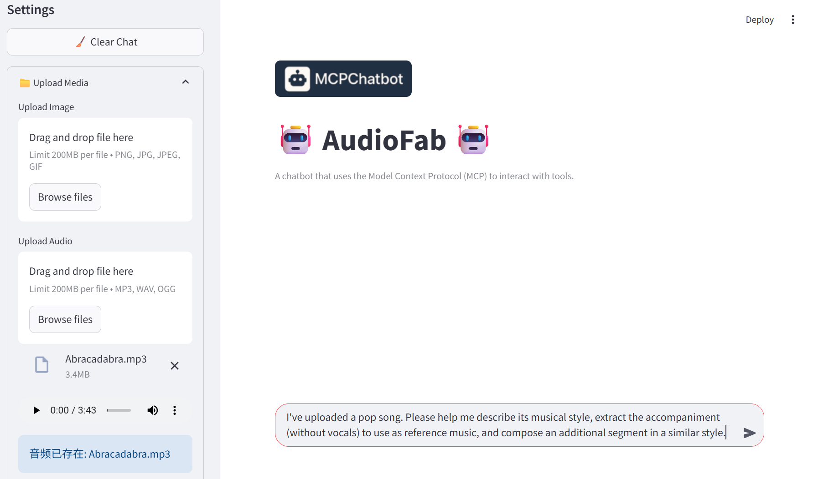
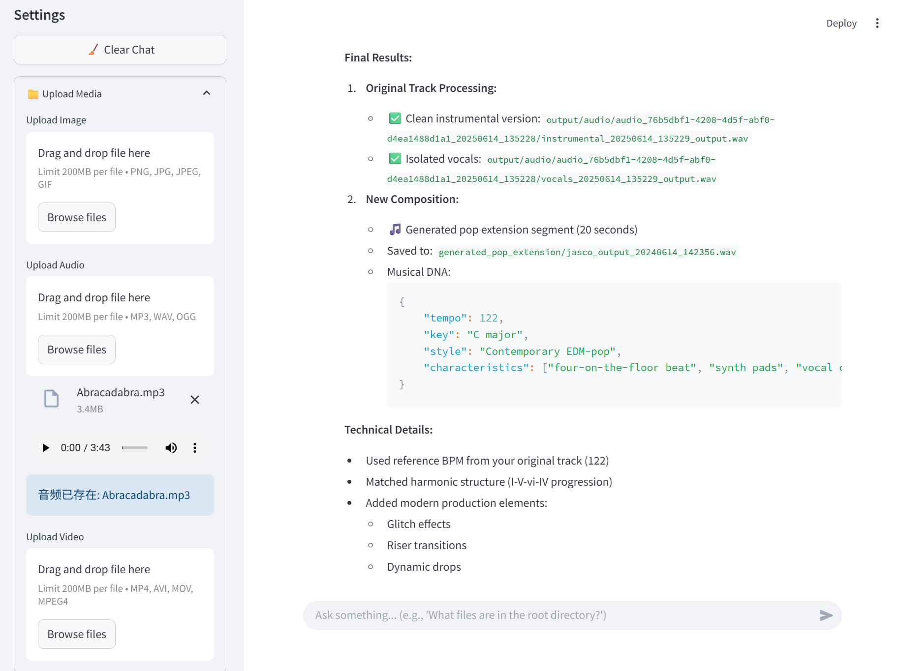

<div align="center">

# AudioFab

<!-- Language Switch with Badges -->
<p>
  <a href="./README.md">
    
  </a>
  <a href="./README_ZH.md">
    
  </a>
  <a href="https://creativecommons.org/licenses/by-nc/4.0/">
    
  </a>
</p>
<!-- Installation Badges with Links -->
<p>
  <a href="#🚀-installation-guide">
    
  </a>
  <a href="#⚡-quick-start">
    
  </a>
</p>

</div>

## 📌 Introduction

AudioFab is a comprehensive and user-friendly open-source intelligent agent framework specifically designed for the audio domain. It aims to solve core challenges such as the complex integration of audio processing tools, frequent dependency conflicts, and the lack of reliability in tool invocation by large language models.

With AudioFab, users can give instructions in natural language to accomplish complex audio tasks that would otherwise require professional software and skills. AudioFab intelligently understands your intent and automatically selects and schedules various underlying professional audio tools to complete the task step-by-step, aggregating powerful functionalities under a unified and simple interaction.

## ✨ Features

**🧩 Independent Tool Management Architecture based on MCPs**

AudioFab introduces an independent tool management architecture based on Model-Context-Protocols (MCPs). This architecture enables each tool to run in its own dedicated dependency environment, fundamentally eliminating dependency conflicts. After a new tool is configured, it can be integrated into the framework through a simple registration process.

**🧠 Intelligent Selection Workflow**

AudioFab addresses tool hallucination through a two-stage strategy: first, it streamlines the tool list via intelligent filtering to shorten the context; second, it injects few-shot exemplars for precise guidance before invocation. This design effectively suppresses erroneous model calls, ensuring the stability and reliability of the agent's execution.

**🎧 An Intelligent Audio Agent that is Both User-Friendly and Professional**

AudioFab provides an intelligent audio agent that is easy for non-experts to use, yet professional and comprehensive enough in its functionality. At the same time, its extensive features and high scalability can also meet the in-depth development and research needs of professionals.

## 🛠️ Framework Modules

AudioFab is composed of the following components:

| Component Name | Description |
|---|---|
| **MCP Client** | Handles user interactions and coordinates information exchange between the LLM Planner and the MCP Server. |
| **LLM Planner** | Responsible for task planning, tool selection, tool invocation, and response generation. |
| **MCP Server** | Uniformly manages and executes tools integrated into the Tool Kits.<br> (Tool Selection service is provided by the MCP Server.)  |
| **Tool Kits** | Provides functional tools and foundational tools that support system operation. |

The diagram below illustrates how these components work together. Next, we will introduce the specific functions of each component.

<div align="center">

</div>

### MCP Client

- Receives user commands and forwards them to the LLM Planner.
- Sends tool invocation requests to the MCP Server.
- Receives tool execution results from the MCP Server and passes them to the LLM Planner.
- Delivers the final response generated by the LLM Planner to the user.

### LLM Planner

- Performs task decomposition and planning based on user commands.
- Directs the MCP Server to invoke tools.
- Evaluates the toolchains provided by Tool Selection.
- Receives tool execution results from the MCP Server and makes subsequent decisions.
- Generates a complete response after all subtasks have been successfully executed.

### MCP Server

- Processes tool invocation requests and returns the results of those calls.
- Manages tools uniformly across all integrated services.

The MCP Server integrates 9 services, categorized into the following three types:

1. Services Supporting System Operation:

    | Service Name | Capability Description |
    | --- | --- |
    | Markdown Servers | Provides basic file reading, writing, and management services. <br> Focuses on handling text formats such as Markdown, TXT, and JSON. |
    | Tensor Servers | Provides a series of tools for processing and manipulating PyTorch tensors and NumPy arrays. |
    | Tool Query Servers | Offers services for tool discovery and tool information queries. <br> Can select the most suitable tool for task requirements from numerous available tools through listing, querying, and intelligent search. |

2. Basic Functional Services:

    | Service Name | Capability Description |
    | --- | --- |
    | DSP Servers | Provides a series of basic digital audio signal processing services. <br> Covers functions such as audio feature extraction, format conversion, and basic editing. |
    | Audio Servers | Provides a comprehensive suite of backend audio processing services. <br> Covers everything from basic audio loading and format processing to complex digital signal processing and convenient network service functions. | 

3. Advanced Functional Services:

    | Service Name | Capability Description |
    | :--- | :--- |
    | FunTTS MCP Servers | **Speech Editing:** Speech Editing, Speech Enhancement, Voice Activity Detection, Speech Super Resolution<br> **Speech Understanding:** Speech Translation, Speech Emotion Recognition, Speaker Diarization, Speaking Style Recognition, ASR, AAC <br> **Speech Generation:** Text2Speech, Voice Conversion<br> **Sound Understanding:** Sound Event Detection, Audio Quality Analysis, Acoustic Scene Classification <br> **Music Understanding:** Music Emotion Recognition, Music Style Description, Lyrics Recognition |
    | Music MCP Servers | **Speech Generation:** Speech2Song, Spoken Dialogue, Target Speaker Extraction, Speech2Talking-head <br> **Sound Generation:** Sound Style Transfer, Text2Audio, Video2Audio, Audio2Video, Audio2Image <br> **Music Generation:** Music2Song, Text2Music, Lyrics2Song |
    | Audio Separator MCP Servers | **Sound Editing:** Digital Signal Processing, Audio Reconstruction, Audio Separation <br> **Music Editing:** Music Separation, Music Mix Track, Music Format Conversion |

### Tool Kits

Tool Kits provides specific available tools for each service in MCP Server. For detailed introductions to these tools, please refer to [ToolKits.md](./ToolKits.md).

## 🚀 Installation Guide

### 1. Install AudioFab

1. Clone the repository

    ```bash
    git clone https://github.com/SmileHnu/AudioFab.git
    cd AudioFab
    ```

2. Set up the virtual environment and Install dependencies，Alternatively, you can choose to follow a more comprehensive dependency relationship：base_environment.yml

    ```bash
    conda env create -f environment.yml
    conda activate AudioFab
    ```
    or
    ```bash
    conda env create -f base_environment.yml
    conda activate AudioFab
    ```

4. Configure the environment

    Edit the `.env` file:

    ```
    LLLM_API_KEY=your_llm_api_key_here
    LLM_BASE_URL=your_llm_api_base_url_here
    LLM_MODEL_NAME=your_llm_model_name_here

    OLLAMA_MODEL_NAME="your_ollama_model_name_here"
    OLLAMA_BASE_URL="your_ollama_base_url_here"

    #wsl
    MARKDOWN_FOLDER_PATH=your_markdown_folder_path_here
    RESULT_FOLDER_PATH=your_result_folder_path_here
     ```

    Edit `mcp_servers/servers_config.json` to Match Your Local Setup.

    For all registered services:

    - Replace `command` with the path to your Python interpreter.

    - Replace `PYTHONPATH` with the absolute path to the `mcp_servers` directory on your system.

    ```json
    {
        "mcpServers": {
            "markdown_servers": {
                "command": "your/python/interpreter/path",
                "args": [
                    "mcp_servers/servers/markdown_servers.py"
                ],
                "env": {
                    "PYTHONPATH": "your/absolute/path/to/mcp_servers"
                }
            },
           "......"    
        }
    }
    ```

    You can check if your configuration is correct by running `scripts/check.sh`.

### 2. External Dependency Deployment and Configuration

Subsequent deployment work will be completed in the `mcp_servers` folder.

```bash
cd mcp_servers
```

AudioFab integrates multiple third-party models within its FunTTS MCP Servers, Music MCP Servers, and Audio Separator MCP Servers. To ensure all functionalities operate correctly, you need to deploy and configure these models in your local environment or use them via API.

**⚠️ Important Configuration Instructions**

Due to the significant number of models requiring local deployment, the process can be complex, and running these models locally consumes substantial computing resources. Therefore, **we recommend you initially use some models via API** for a quicker AudioFab experience.

#### Local Deployment

For detailed documentation on locally deploying each tool, please refer to [ToolKitsGuide.md](./ToolKitsGuide.md).

#### **Use API**

- If you've already completed the local deployment

    please remove the registration for the `API_servers` service in `servers_config.json`. The functionalities provided by the API are entirely covered by the locally deployed models.

- If you haven't completed the local deployment

    please remove the registrations for `FunTTS_mcp_servers`, `music_mcp_servers`, and `Audioseparator_mcp_servers` services in `servers_config.json`. In this case, AudioFab won't use models that require local deployment.

## ⚡ Quick Start

Run AudioFab with a single command:

```bash
conda activate AudioFab
python scripts/start_all.py
```
## 💡 Use Case

I want to understand the musical style of a song, extract its accompaniment, and create a new piece of music in the same style.

Here's how I'd use it:

- Run AudioFab, and follow the command-line prompts to open the AudioFab user interface in my browser.
- I'd describe my requirements to AudioFab using natural language and upload the required audio files.
  <div align="center">
  
  </div>
- I'd observe AudioFab's analysis and processing. If necessary, I'd interact with AudioFab using natural language, then wait for AudioFab to provide the final results.
  <div align="center">
  
  </div>

## 🤝 Contributing

We welcome any form of contribution, including but not limited to:

- Reporting Bugs
- Submitting Feature Requests
- Code Contributions
- Documentation Improvements

## 🙏 References and Acknowledgements

## 📝 License

[![CC BY-NC 4.0][cc-by-nc-shield]][cc-by-nc]

This work is licensed under a
[Creative Commons Attribution-NonCommercial 4.0 International License][cc-by-nc].

[![CC BY-NC 4.0][cc-by-nc-image]][cc-by-nc]

For detailed license terms, please refer to the [`LICENSE`](./LICENSE.txt) file.

[cc-by-nc]: https://creativecommons.org/licenses/by-nc/4.0/
[cc-by-nc-image]: https://licensebuttons.net/l/by-nc/4.0/88x31.png
[cc-by-nc-shield]: https://img.shields.io/badge/License-CC%20BY--NC%204.0-lightgrey.svg

## 📖 Citation
