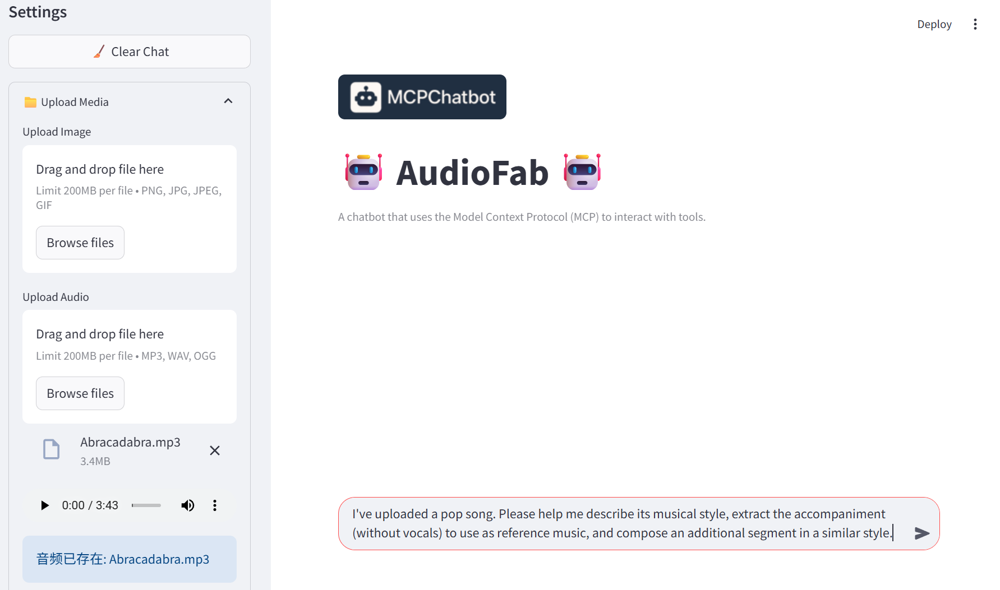
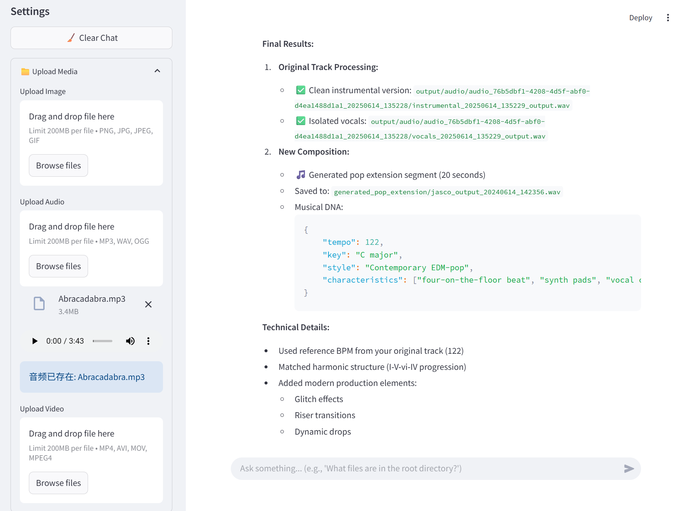

<div align="center">

# AudioFab

<!-- Language Switch with Badges -->
<p>
  <a href="./README.md">
    
  </a>
  <a href="./README_ZH.md">
    
  </a>
  <a href="https://creativecommons.org/licenses/by-nc/4.0/">
    
  </a>
</p>
<!-- Installation Badges with Links -->
<p>
  <a href="#🚀-安装指南">
    
  </a>
  <a href="#⚡-快速开始">
    
  </a>
</p>

</div>

## 📌 简介

AudioFab 是一个专为音频领域打造的、全面且用户友好的开源智能代理框架，旨在解决音频处理工具集成复杂、依赖冲突频发以及大型语言模型在工具调用中可靠性不足等核心挑战。

通过 AudioFab，用户可以用自然语言下达指令，由 AudioFab 完成以往需要专业软件和技能才能实现的复杂音频任务。AudioFab 会智能地理解您的意图，并自动选择、调度底层各种专业的音频工具来一步步完成任务，将强大的功能聚合在统一、简单的交互之下。

## ✨ 功能特性

**🧩 基于 MCPs 的独立工具管理架构**

AudioFab 引入了基于模型上下文协议（MCPs）的独立工具管理架构。该架构使每一个工具都能运行在专属的依赖环境中，从根本上杜绝了依赖冲突。一个新工具在配置完成后，仅需通过简单的注册步骤便可集成到框架中。

**🧠 抑制工具幻觉的智能选择工作流**

AudioFab 通过两阶段策略应对工具幻觉：首先，通过智能筛选精简工具列表以缩短上下文；其次，在调用前注入小样本示例（Few-Shot Exemplars）进行精确引导。此设计有效抑制了模型的错误调用，确保了代理执行的稳定与可靠。

**🎧 兼具易用性与专业性的智能音频代理**

AudioFab 为非专家提供一个易于使用，同时功能又足够专业和全面的智能音频代理。同时，其全面的功能与高可扩展性亦能满足专业人士的深度开发与研究需求。

## 🛠️ 框架模块

AudioFab 由以下几部分组件构成。

| 组件名称 | 描述 |
|---|---|
| **MCP Client** | 负责处理用户交互，并协调 LLM Planner 和 MCP Server 之间的信息交换 |
| **LLM Planner** | 负责任务规划、工具选择、工具调用和响应生成 |
| **MCP Server** | 统一管理和执行 Tool Kits 中集成的工具<br>(Tool Selection 服务由 MCP Server 提供)  |
| **Tool Kits** | 提供功能性工具和支持系统运行的基础性工具 |

下图展示了组件间的协同工作方式，接下来将依次介绍各组件的具体功能。

<div align="center">

</div>

### MCP Client

- 接收用户命令，将用户命令转发给 LLM Planner
- 向 MCP Server 发送工具调用请求
- 接收 MCP Server 返回的工具执行结果，并将其传递给 LLM Planner
- 将 LLM Planner 生成的最终响应交付给用户

### LLM Planner

- 根据用户命令进行任务分解与规划
- 指导 MCP Server 进行工具调用
- 评估 Tool Selection 提供的工具链
- 接收 MCP Server 返回的工具执行结果，并做出后续决策
- 所有子任务成功执行后，生成完整的响应

### MCP Server

- 处理工具调用请求，返回调用结果
- 对各个服务下的工具进行统一管理

在 MCP Server 中，集成了 9 种服务，可分为以下三类：

1. 支持系统运行的服务：

    | 服务名称 | 能力描述 |
    | --- | --- |
    | **Markdown Servers** | 提供基础的文件读写和管理服务<br>专注于处理 Markdown、TXT 和 JSON 等文本格式的文件 |
    | **Tensor Servers** | 提供一系列用于处理和操作 PyTorch 张量和 NumPy数组的工具 |
    | **Tool Query Servers** | 提供工具发现和工具信息查询的服务<br>能在众多可用工具中，通过列出、查询和智能搜索的方式，选择出最适合其任务需求的工具 |

2. 基础功能性服务：

    | 服务名称 | 能力描述 |
    | --- | --- |
    | **DSP Servers** | 提供一系列基础的数字音频信号处理服务<br>涵盖了音频特征提取、格式转换以及基础编辑等功能 |
    | **Audio Servers** | 提供一套全面的后端音频处理服务<br>涵盖了从基础的音频加载、格式处理，到复杂的数字信号处理，以及便捷的网络服务功能 | 

3. 前沿功能性服务：

    | 服务名称 | 能力描述 |
    | :--- | :--- |
    | **FunTTS MCP** | **语音编辑 (Speech Editing)** <br> 语音编辑 (Speech Editing), 语音增强 (Speech Enhancement), 语音活动检测 (Voice Activity Detection), 语音超分辨率 (Speech Super Resolution) <br> **语音理解 (Speech Understanding)** <br> 语音翻译 (Speech Translation), 语音情感识别 (Speech Emotion Recognition), 说话人识别 (Speaker Diarization), 说话风格识别 (Speaking Style Recognition), 自动语音识别 (ASR), 自动音频字幕 (AAC) <br> **语音生成 (Speech Generation)** <br> 文本转语音 (Text2Speech), 声音转换 (Voice Conversion) <br> **声音理解 (Sound Understanding)** <br> 声音事件检测 (Sound Event Detection), 音频质量分析 (Audio Quality Analysis), 声学场景分类 (Acoustic Scene Classification) <br> **音乐理解 (Music Understanding)** <br> 音乐情感识别 (Music Emotion Recognition), 音乐风格描述 (Music Style Description), 歌词识别 (Lyrics Recognition) |
    | **Music MCP** | **语音生成 (Speech Generation)** <br> 语音转歌曲 (Speech2Song), 口语对话 (Spoken Dialogue), 目标说话人提取 (Target Speaker Extraction), 语音驱动说话人视频 (Speech2Talking-head) <br> **声音生成 (Sound Generation)** <br> 声音风格迁移 (Sound Style Transfer), 文本转音频 (Text2Audio), 视频转音频 (Video2Audio), 音频转视频 (Audio2Video), 音频转图像 (Audio2Image) <br> **音乐生成 (Music Generation)** <br> 音乐转歌曲 (Music2Song), 文本转音乐 (Text2Music), 歌词转歌曲 (Lyrics2Song) |
    | **Audio Separator MCP** | **声音编辑 (Sound Editing)** <br> 数字信号处理 (Digital Signal Processing), 音频重建 (Audio Reconstruction), 音频分离 (Audio Separation) <br> **音乐编辑 (Music Editing)** <br> 音乐分离 (Music Separation), 音乐混音轨道 (Music Mix Track), 音乐格式转换 (Music Format Conversion) |

### Tool Kits

Tool Kits 为 MCP Server 中的每一个服务提供了一些具体可用的工具。关于这些工具的详细介绍可见 [ToolKits_ZH.md](./ToolKits_ZH.md)

## 🚀 安装指南

### 1. 安装 AudioFab

1. 克隆仓库

    ```bash
    git clone https://github.com/SmileHnu/AudioFab.git
    cd AudioFab
    ```

2. 设置虚拟环境并安装依赖项

    ```bash
    conda env create -f environment.yml
    conda activate AudioFab
    ```
    或者您也可以选择使用一个更全面的依赖关系文件：`environment-lock.yml`
    ```bash
    conda env create -f environment-lock.yml
    conda activate AudioFab
    ```

3. 配置运行环境

    编辑 `.env` 文件：

    ```
    LLM_API_KEY=
    LLM_BASE_URL=
    LLM_MODEL_NAME=

    OLLAMA_MODEL_NAME="your_ollama_model_name_here"
    OLLAMA_BASE_URL="your_ollama_base_url_here"

    #The address of the file (such as .md, .json, .txt, etc.) you want to process.
    MARKDOWN_FOLDER_PATH=
    RESULT_FOLDER_PATH=
    ```

    编辑 `mcp_servers/servers_config.json` 以匹配您的本地设置：将每个服务下的 `command` 替换为您的 python 解释器路径。

    ```json
    {
        "mcpServers": {
            "markdown_servers": {
                "command": "your/python/interpreter/path",
                "args": [
                    "mcp_servers/servers/markdown_servers.py"
                ],
                "env": {
                    "PYTHONPATH": "."
                }
            },
          "......"
        }
    }
    ```

    您可以通过运行 `scripts/check.sh` 来检查配置是否正确。

### 2. 外部依赖部署与配置

将在 `mcp_servers` 文件夹中完成后续的部署工作。

```bash
cd mcp_servers
```

AudioFab 在 FunTTS MCP Servers、Music MCP Servers 和 Audio Separator MCP Servers 中集成了多个第三方模型，为了确保所有功能都能正常运行，您需要在本地环境中部署和配置或通过 API 使用这些模型。

**⚠️ 重要配置说明**

由于需要本地部署的模型数量较多，导致本地部署工作繁杂，且本地运行这些模型时会占用大量的计算资源，因此**更建议您先通过 API 使用部分模型**以快速体验 AudioFab。

#### **使用 API**

请在 `servers/API_servers.py` 中 添加 `MD_TOKEN` 和 `HF_TOKEN`

```python
MD_TOKEN = "your_MD_TOKEN_here"
HF_TOKEN = "your_HF_TOKEN_here"
```

#### **本地部署**

本地部署各工具的的详细说明文档见 [ToolKitsGuide_ZH.md](./ToolKitsGuide_ZH.md)

❗ 如果您未完成本地部署：

请在 `servers_config.json`，中删除对 `FunTTS_mcp_servers`、`music_mcp_servers` 和 `Audioseparator_mcp_servers` 服务的注册。此时 AudioFab 不会使用需要本地部署的模型。

## ⚡ 快速开始

一键运行 AudioFab

```bash
conda activate AudioFab
python scripts/start_all.py
```

## 💡 使用案例

### 🎬 视频演示

为了更直观地展示 AudioFab 的强大功能，我们录制了一个演示视频，涵盖了以下两个核心场景：

**语音情感分析与数字人视频生成**：上传一段生气情感的语音，利用 AudioFab 分析其情感，并生成相反（如平静）情感的语音。最后，使用新生成的语音驱动数字人模型，合成一段全新的口型同步视频。


https://github.com/user-attachments/assets/0508273b-c180-4cf2-9c9d-e9f3af88d071


**音乐分析与处理**：上传一首歌曲，实现人声与伴奏的精准分离。随后，对分离出的伴奏进行曲风分析，为后续的音乐创作或改编提供依据。


https://github.com/user-attachments/assets/973bb28f-52a8-42ee-87bd-245e8e1e86ec


### 📄 图文示例

现在我想要了解一首歌曲的音乐风格，获得歌曲的伴奏，并且创作一段和这首歌一样风格的音乐。

以下是我的使用方法：

- 一键运行 AudioFab，根据命令行提示，在浏览器中打开 AudioFab 用户界面
- 用自然语言向 AudioFab 描述我的需求，并上传必要的文件
  <div align="center">
  
  </div>
- 查看 AudioFab 的分析与处理过程，必要时通过自然语言与 AudioFab 交互，等待 AudioFab 给出最终结果
  <div align="center">
  
  </div>
  
## 🤝 贡献

我们欢迎任何形式的贡献，包括但不限于：

- 报告 Bug
- 提交功能请求
- 代码贡献
- 文档改进

## 🙏 参考与致谢

AudioFab 将持续维护更新。贡献者列表会动态更新，目前仍在整理中，敬请期待！

## 📝 许可证

[![CC BY-NC 4.0][cc-by-nc-shield]][cc-by-nc]

本作品采用
[知识共享署名-非商业性使用 4.0 国际许可协议][cc-by-nc] 进行许可。

[![CC BY-NC 4.0][cc-by-nc-image]][cc-by-nc]

详细许可证条款请参阅 [`LICENSE`](./LICENSE.txt) 文件。

[cc-by-nc]: https://creativecommons.org/licenses/by-nc/4.0/
[cc-by-nc-image]: https://licensebuttons.net/l/by-nc/4.0/88x31.png
[cc-by-nc-shield]: https://img.shields.io/badge/License-CC%20BY--NC%204.0-lightgrey.svg

## 📖 引用
